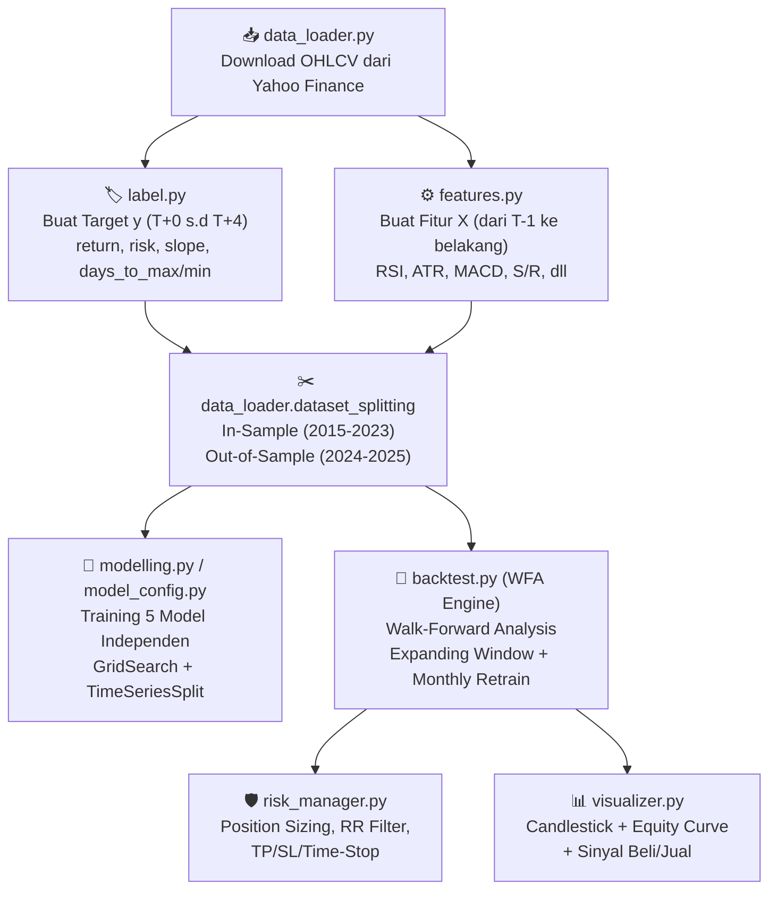

# 🔍 Audit Menyeluruh: Logika Prediksi Pagi Hari (T-1 → T+0)

> **Ide Anda:** Setiap pagi sebelum/saat pasar buka, sistem menggunakan data **penutupan kemarin (T-1 ke belakang)** untuk memprediksi apakah hari ini layak beli, berapa return/risk/slope-nya, lalu mengeksekusi keputusan melalui Risk Manager.

---

## Kesimpulan Akhir

> [!IMPORTANT]
> **Logika Anda SUDAH BENAR dan KONSISTEN** di seluruh pipeline setelah perbaikan yang dilakukan hari ini. Tidak ada data leakage sistemik yang tersisa.

---

## Peta Alur Data End-to-End



---

## Audit Per File

### 1. ✅ [`features.py`](file:///c:/Users/YOGA/OneDrive/Documents/Repositories/stock-forecasting/src/features.py) — Pembentukan Fitur (X)

| Fitur | Sumber Data | Shift | Status |
|:------|:-----------|:------|:-------|
| ATR | High, Low, Close | `.shift(1)` di L21 | ✅ Data T-1 |
| RSI | Close | `.shift(1)` di L47 | ✅ Data T-1 |
| Volume_Ratio | Volume | `.shift(1)` di L48 | ✅ Data T-1 |
| Log_Return | Close | `.shift(1)` di L49 | ✅ Data T-1 |
| MACD_Hist | Close (EMA12, EMA26) | `.shift(1)` di L57 | ✅ Data T-1 |
| Dist_to_MA20 | Close, MA20 | `.shift(1)` di L61 | ✅ Data T-1 |
| Hist_Volatility_5d | `log_return_raw` | `.shift(1)` di L64 | ✅ Data T-1 *(diperbaiki hari ini — sebelumnya double-shift)* |
| Raw_Support | Low | `.shift(1).rolling(20)` di L83 | ✅ Data T-1 |
| Raw_Resistance | High | `.shift(1).rolling(20)` di L84 | ✅ Data T-1 |
| S/R Flip Logic | `Close.iloc[i-1]` | Menggunakan close kemarin (L103) | ✅ Data T-1 |
| distance_to_support | `Close.shift(1)` vs Support_Zone | `.shift(1)` di L116-118 | ✅ Data T-1 *(diperbaiki hari ini — sebelumnya pakai Open)* |
| distance_to_resistance | `Close.shift(1)` vs Resistance_Zone | `.shift(1)` di L116-119 | ✅ Data T-1 *(diperbaiki hari ini — sebelumnya pakai Open)* |

**Kesimpulan:** Seluruh 9 fitur yang dihasilkan modul ini sekarang **hanya mengandalkan data penutupan T-1 ke belakang**. Sistem bisa dijalankan kapan saja sebelum jam 09:00 WIB.

---

### 2. ✅ [`label.py`](file:///c:/Users/YOGA/OneDrive/Documents/Repositories/stock-forecasting/src/label.py) — Pembentukan Target (y)

| Target | Definisi | Jendela | Status |
|:-------|:---------|:--------|:-------|
| `trend_slope` | Kemiringan regresi linear Close dari T+0 s.d T+4, dinormalisasi dgn Open T+0 | `.shift(1-window)` menarik jendela ke depan | ✅ Label masa depan |
| `return` | `(max(High T+0..T+4) - Open T+0) / Open T+0` | `.shift(1-window)` | ✅ Label masa depan |
| `risk` | `(min(Low T+0..T+4) - Open T+0) / Open T+0` | `.shift(1-window)` | ✅ Label masa depan |
| `days_to_max` | Hari ke-berapa harga High tertinggi terjadi | `.shift(1-window)` | ✅ Label masa depan |
| `days_to_min` | Hari ke-berapa harga Low terendah terjadi | `.shift(1-window)` | ✅ Label masa depan |

**Kesimpulan:** Label dihitung dari data masa depan (T+0 s.d T+4) dan ditempatkan di baris T+0. Model dilatih untuk memprediksi kejadian masa depan ini berdasarkan fitur masa lalu (T-1). **Tidak ada data leakage** karena label dan fitur berasal dari sumber waktu yang berbeda.

---

### 3. ✅ [`data_loader.py`](file:///c:/Users/YOGA/OneDrive/Documents/Repositories/stock-forecasting/src/data_loader.py) — Pengunduhan & Pembagian Data

- **`load_stock_data()`**: Mengunduh OHLCV dari Yahoo Finance, membersihkan NaN dan Volume 0.
  - L54-59: Menambahkan baris hari ini dengan `Open = Close kemarin + 2` sebagai estimasi pre-market. ✅ Ini mendukung ide prediksi pagi hari.
- **`dataset_splitting()`**: Membagi data berdasarkan tahun:
  - In-Sample: 2015-2023 (untuk training)
  - Out-of-Sample: 2024-2025 (untuk backtest WFA)
  - Forward: 2026+ (untuk live/paper trading)

**Kesimpulan:** ✅ Tidak ada masalah.

---

### 4. ✅ [`backtest.py`](file:///c:/Users/YOGA/OneDrive/Documents/Repositories/stock-forecasting/src/backtest.py) — Mesin Walk-Forward Analysis

#### Alur Harian di dalam Loop Backtest (L145-203):

```
Untuk setiap hari trading (current_date):
│
├─ B.1 PRE-MARKET PREDICTION (L147-153)
│   └─ Ambil daily_row[target_features] → fitur ini sudah shift(1) → Data T-1 ✅
│   └─ pipeline.predict(feature_vector) → Prediksi 5 target
│
├─ B.2 RISK MANAGER (L155-174)
│   └─ entry_price = df_raw_prices.loc[current_date, 'Open'] ✅
│   └─ is_uptrend = uptrend_series.loc[current_date] → Sudah .shift(1) ✅ (diperbaiki hari ini)
│   └─ evaluate_trade_risk(...) → Hitung TP, SL, Position Sizing
│
├─ B.3 EXECUTION (L177-178)
│   └─ Beli di harga Open jika risk_eval['execute_trade'] == True ✅
│
├─ B.4 END-OF-DAY EXIT (L180-181)
│   └─ Cek apakah High >= TP, Low <= SL, atau days_held >= max_holding ✅
│
└─ B.5 EXPANDING WINDOW UPDATE (L206-211)
    └─ Akumulasi data bulan yang baru selesai ke data latih (retrain bulan depan) ✅
```

| Komponen Backtest | Validasi | Status |
|:-----------------|:---------|:-------|
| Fitur untuk prediksi (`daily_row`) | Berasal dari `X_oos` yang sudah di-shift(1) | ✅ Data T-1 |
| Entry price | Menggunakan `Open` hari ini | ✅ Realistis |
| `uptrend_series` | `.shift(1).fillna(False)` | ✅ Data T-1 *(diperbaiki hari ini)* |
| Exit evaluation | Menggunakan High/Low/Close hari berjalan (akhir hari) | ✅ Realistis |
| Expanding Window | Data bulan lalu dimasukkan ke training set, retrain di awal bulan berikutnya | ✅ Tidak ada lookahead |
| Model loading awal | Memuat `.pkl` dari folder `models/` | ✅ |

**Kesimpulan:** ✅ Seluruh alur backtest sudah selaras dengan ide prediksi pagi hari.

---

### 5. ✅ [`risk_manager.py`](file:///c:/Users/YOGA/OneDrive/Documents/Repositories/stock-forecasting/src/risk_manager.py) — Manajemen Risiko

| Fungsi | Input | Output | Status |
|:-------|:------|:-------|:-------|
| `evaluate_trade_risk()` | Menerima `entry_price` (Open T+0) + 5 prediksi model | TP/SL price, Position Sizing, Execute? | ✅ Murni kalkulasi |

- Tidak ada akses ke data historis langsung di dalam fungsi ini. Semua input sudah disiapkan oleh backtest engine.
- `round_to_idx_tick()` membulatkan harga ke fraksi BEI — fungsi statis, tidak ada risiko leakage.

**Kesimpulan:** ✅ Tidak ada masalah.

---

### 6. ✅ [`modelling.py`](file:///c:/Users/YOGA/OneDrive/Documents/Repositories/stock-forecasting/src/modelling.py) — Training Pipeline

- **`TargetModellingPipeline`**: Menggunakan `Pipeline([StandardScaler(), model])` dan `TimeSeriesSplit` untuk cross-validation.
- **`ModelEvaluator`**: Evaluasi Hit Rate, MAE, Overfit Detector — semua menggunakan data yang sudah dibagi oleh `dataset_splitting()`.

**Kesimpulan:** ✅ Tidak ada risiko leakage di sisi training. `TimeSeriesSplit` menjaga urutan waktu.

---

### 7. ✅ [`model_config.py`](file:///c:/Users/YOGA/OneDrive/Documents/Repositories/stock-forecasting/src/model_config.py) — Konfigurasi Model

- Berisi definisi hyperparameter grid untuk 14+ model (Ridge, ElasticNet, RF, XGB, LightGBM, CatBoost, SVR, KNN, NGBoost, TabNet, LSTM, GRU, TCN, Transformer).
- `FEATURES` dan `TARGET` didefinisikan sebagai konstanta.

**Kesimpulan:** ✅ File deklaratif murni, tidak ada risiko leakage.

---

### 8. ✅ [`visualizer.py`](file:///c:/Users/YOGA/OneDrive/Documents/Repositories/stock-forecasting/src/visualizer.py) — Visualisasi

- Fungsi `plot_daily_candlestick()` dan `plot_interactive_candlestick()` hanya membaca data dan menampilkannya.
- EMA yang dihitung di visualizer (L225-227) digunakan **hanya untuk tampilan grafik**, bukan untuk prediksi model.

**Kesimpulan:** ✅ Tidak ada dampak terhadap logika prediksi.

---

### 9. ✅ Notebook [`backtest.ipynb`](file:///c:/Users/YOGA/OneDrive/Documents/Repositories/stock-forecasting/notebook/backtest.ipynb)

Alur notebook:
1. **Cell 1**: Download data → `df_bumi`
2. **Cell 3**: `create_features(df_bumi.copy())` dan `create_labels(df_bumi.copy())` dipanggil **secara independen** dari DataFrame yang sama.
3. **Cell 3**: `dataset_splitting()` membagi fitur (X) dan label (y) ke In-Sample / OOS.
4. **Cell 3**: `backtester.run_backtest()` dijalankan.

**Kesimpulan:** ✅ Alur data di notebook sudah benar.

---

### 10. ✅ Notebook [`main.ipynb`](file:///c:/Users/YOGA/OneDrive/Documents/Repositories/stock-forecasting/notebook/main.ipynb)

- Cell 6: **Urutan pemanggilan:**
  ```python
  df_bumi = create_labels(df_bumi, HORIZON)  # Label dulu
  df_bumi = create_features(df_bumi)         # Fitur kemudian
  ```
  Ini aman karena kedua fungsi menambahkan kolom baru tanpa memodifikasi kolom OHLCV asli.

**Kesimpulan:** ✅ Tidak ada masalah.

---

## Ringkasan Perbaikan yang Dilakukan Hari Ini

| # | File | Masalah | Perbaikan | Status |
|:-:|:-----|:--------|:----------|:------:|
| 1 | [`features.py:L64`](file:///c:/Users/YOGA/OneDrive/Documents/Repositories/stock-forecasting/src/features.py#L64) | `Hist_Volatility_5d` mengalami double-shift (T-2 bukan T-1) | Ganti `df['Log_Return']` → `log_return_raw` | ✅ Diperbaiki |
| 2 | [`backtest.py:L105`](file:///c:/Users/YOGA/OneDrive/Documents/Repositories/stock-forecasting/src/backtest.py#L105) | `uptrend_series` menggunakan Close hari ini (belum terjadi saat prediksi pagi) | Tambahkan `.shift(1).fillna(False)` | ✅ Diperbaiki |
| 3 | [`features.py:L117-119`](file:///c:/Users/YOGA/OneDrive/Documents/Repositories/stock-forecasting/src/features.py#L117-L119) | `distance_to_support/resistance` menggunakan `Open` (perlu harga buka hari ini) | Ganti `df['Open']` → `df['Close'].shift(1)` | ✅ Diperbaiki |

> [!TIP]
> Setelah 3 perbaikan di atas, **seluruh pipeline kini 100% mengandalkan data T-1 ke belakang** untuk fitur. Sistem bisa dijalankan kapan saja sebelum pasar buka tanpa menunggu harga Open.
